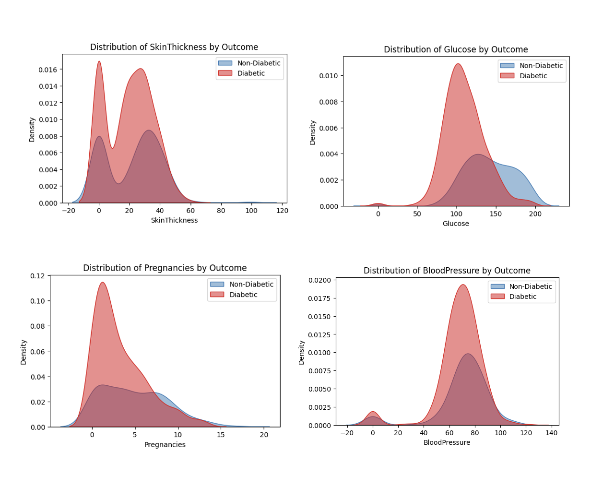
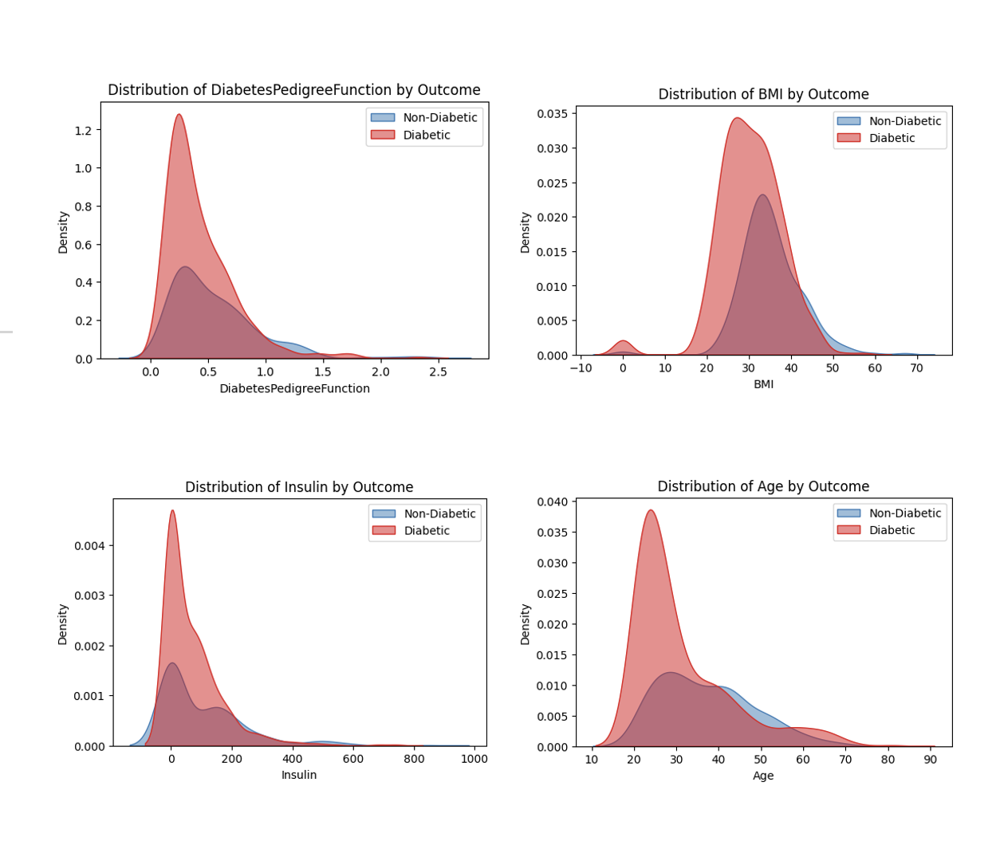
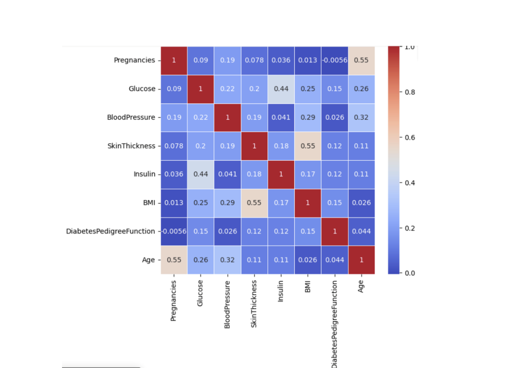
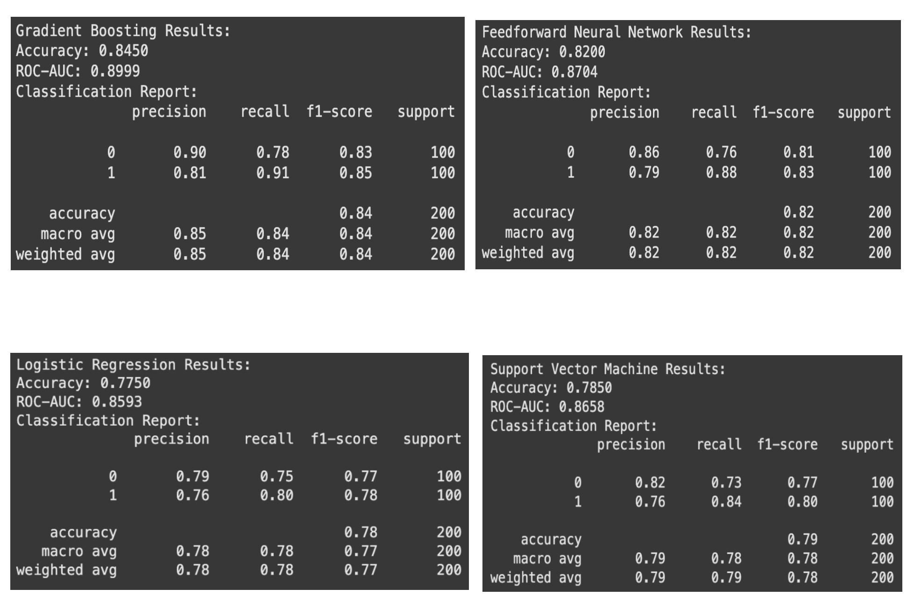

# Diabetes Prediction Using Machine Learning and Deep Learning

A data-driven project aimed at predicting the likelihood of diabetes in individuals using advanced machine learning and deep learning models. This project was completed as part of a Data Science course.

## Project Overview

Diabetes is increasingly prevalent due to modern sedentary lifestyles and poor dietary choices. To aid early detection, this project develops a classification model using the PIMA Indian Diabetes dataset to determine whether a person has diabetes or not.

We implemented and compared four supervised learning algorithms:

- Logistic Regression  
- Support Vector Machine (SVM)  
- Gradient Boosting  
- Feedforward Neural Network (FNN)  

Out of these, the **Gradient Boosting model delivered the highest accuracy at 84.5%**, along with an **AUC score of 0.8999**, making it the most effective model for this task.

## Dataset

The **PIMA Indian Diabetes Dataset** was used in this project. It contains medical records of **768 female patients** from the Pima Indian population, including the following features:

- Number of Pregnancies  
- Glucose Level  
- Blood Pressure  
- Skin Thickness  
- Insulin Level  
- BMI (Body Mass Index)  
- Diabetes Pedigree Function  
- Age  
- Outcome (1 = diabetic, 0 = non-diabetic)

## 🛠️ Technologies Used

- Python  
- Google Colab  
- Pandas, NumPy  
- Scikit-learn  
- TensorFlow & Keras  
- Seaborn and Matplotlib  
- SMOTE (Synthetic Minority Oversampling Technique)

## Methodology

### 1. Data Preprocessing
- Removed duplicate entries  
- Replaced zero values in key features (e.g., Glucose, Blood Pressure) with mean/median values  
- Normalized numerical features for consistent scaling  
- Balanced class distribution using **SMOTE**

### 2. Data Visualization
- Created histograms to understand feature distributions  
- Generated a correlation heatmap to identify relationships between variables  

  
  

### 3. Model Training & Evaluation

| Model                 | Accuracy | ROC-AUC |
|----------------------|----------|---------|
| Logistic Regression  | 77.5%    | 0.86    |
| Support Vector Machine | 78.5%    | 0.8659  |
| Gradient Boosting    | **84.5%** | **0.8999** |
| Feedforward Neural Network | 79.5%    | ~0.88    |

Each model was trained on a balanced dataset and evaluated using:
- Accuracy  
- ROC-AUC Score  
- Classification Report (Precision, Recall, F1-score)

## Neural Network Architecture

- **Input Layer**: 8 Features  
- **Dense Layer 1**: 256 Neurons, ReLU activation, Batch Normalization, Dropout (30%)  
- **Dense Layer 2**: 128 Neurons, L2 Regularization, BatchNorm, Dropout (30%)  
- **Dense Layer 3**: 64 Neurons, ReLU activation, Dropout (20%)  
- **Output Layer**: 1 Neuron with Sigmoid Activation for binary classification  

## 📈 Future Work

- Enhance model generalization through hyperparameter tuning and cross-validation  
- Build a web-based interface for real-time predictions using Flask or Streamlit  
- Integrate personalized health recommendations based on model output  

## Files in this Repository

| File                 | Description                                 |
|----------------------|---------------------------------------------|
| `diabetes_prediction.py` | Python script for preprocessing and model training |
| `diabetes.csv`           | Cleaned and preprocessed dataset |
| `README.md`              | Project documentation (this file) |
